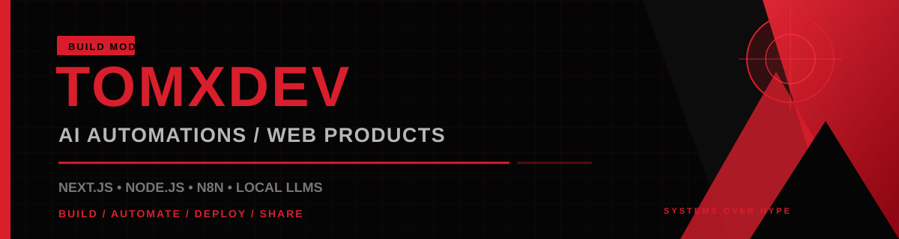

<div align="center">



<br/>

[](https://www.linkedin.com/in/tomxdev/)
[](mailto:mymiserablemind17@gmail.com)
[](https://github.com/MYMISERABLEMIND17?tab=followers)
[](https://github.com/MYMISERABLEMIND17)

</div>

---

## `01 / IDENTITY`

> **Systems over hype. Useful software over empty demos.**

I build practical software at the intersection of **full-stack development, workflow automation, and local AI**.

The goal is simple: find a repetitive workflow or a real product problem, then build the smallest reliable system that solves it.

```text
BUILD      web products, APIs, real-time systems and internal tools
AUTOMATE   repetitive workflows with n8n, Python and LLMs
DEPLOY     self-hosted services with Linux, Docker, PM2 and systemd
LEARN      Java DSA, backend architecture and open-source collaboration
SHARE      architecture, mistakes, trade-offs and lessons as tomxdev
```

---

## `02 / SELECTED SYSTEMS`

<table>
<tr>
<td width="50%" valign="top">

### AI Content Engine
Turns long-form input into structured short-form content through extraction, drafting, critique, refinement, and approval stages.

`n8n` `LLM APIs` `Notion` `Automation`


</td>
<td width="50%" valign="top">

### WINKD
A real-time social game platform with shared rooms, session history, timelines, milestones, and product analytics.

`Next.js` `TypeScript` `PostgreSQL` `Redis` `WebSockets`


</td>
</tr>
<tr>
<td width="50%" valign="top">

### Discovery & Monitoring Systems
Automation pipelines for job discovery, GitHub issue monitoring, lead research, scoring, filtering, and structured delivery.

`Python` `n8n` `APIs` `Ollama` `Local LLMs`


</td>
<td width="50%" valign="top">

### Java DSA Journey
Pattern-based Java problem solving across arrays, strings, bit manipulation, two pointers, sliding window, hashing, and more.

`Java` `LeetCode` `Data Structures`

[](https://github.com/MYMISERABLEMIND17/LEARN-JAVA-DSA)

</td>
</tr>
</table>

---

## `03 / ENGINEERING FOCUS`

<table>
<tr>
<td width="33%" valign="top">

### `WEB`
- Next.js and React
- TypeScript and JavaScript
- Node.js and Express
- REST APIs and WebSockets
- Responsive product interfaces

</td>
<td width="33%" valign="top">

### `AUTOMATION`
- n8n workflows
- Python automation
- Ollama and local LLMs
- OpenAI and Claude APIs
- Multi-step agent pipelines

</td>
<td width="33%" valign="top">

### `INFRA`
- PostgreSQL and Redis
- Supabase and MongoDB
- Linux and Docker
- PM2 and systemd
- Git and GitHub

</td>
</tr>
</table>

---

## `04 / TOOLBELT`

<div align="center">


</div>

---

## `05 / OPEN SOURCE`

| Project | Work | State |
|---|---|---|
| [CircuitVerseDocs](https://github.com/CircuitVerse/CircuitVerseDocs/pull/535) | Documentation clarity and correctness improvements | Open proposal |
| [Learning Unlimited — ESP Website](https://github.com/learning-unlimited/ESP-Website/pull/4687) | Long-answer survey textarea behaviour fix | Reviewed and closed |

I focus on understanding the issue, proposing a small reviewable change, and communicating the reasoning clearly—not chasing contribution counts.

---

## `06 / ACTIVITY`

<div align="center">


<br/>


</div>

---

## `07 / CURRENT PROCESS`

```yaml
building:
  - AI automation workflows
  - full-stack web products
  - self-hosted developer systems

learning:
  - backend architecture
  - local AI infrastructure
  - Java DSA patterns

open_to:
  - full-stack and AI automation internships
  - startup and founding-engineer opportunities
  - web, MVP and workflow-automation projects
  - open-source and technical collaborations
```

<div align="center">

### `BUILD USEFUL THINGS / EXPLAIN THEM CLEARLY / IMPROVE IN PUBLIC`

[](mailto:mymiserablemind17@gmail.com)

</div>
